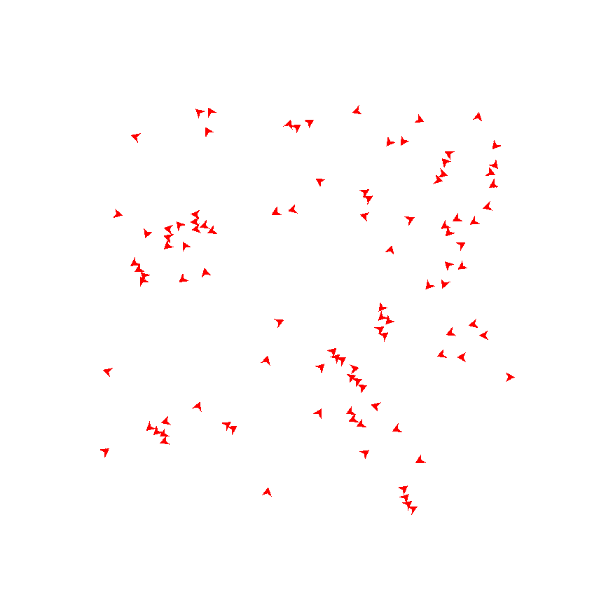

# Rust Flockers
An initial attempt at implementing visualization for an agent based simulation, by relying on RustAB for part of the logic.
Flockers was chosen since it's one of the easiest simulations.

# How to run
Simply run `cargo run`, or `cargo run --release` for a slower to compile, faster to execute option.

# Current issues
- The sprite bounding box seems to not be properly aligned to the sprite itself. The collision actually happens with a smaller bounding box.

- The movements look sudden, sometimes flockers flying together try to collide with each other slightly while moving. This might be caused by the use of set_translation_xyz() instead of appending the vector movement, thus causing the translations to not look perfectly smooth.

# References:
- https://github.com/spagnuolocarmine/abm/blob/master/examples/boids_ui.rs
- https://github.com/eclab/mason/tree/f89201872a91c2176e5dcbcdd1960d3fa6fe1f91/mason/src/main/java/sim/app/flockers